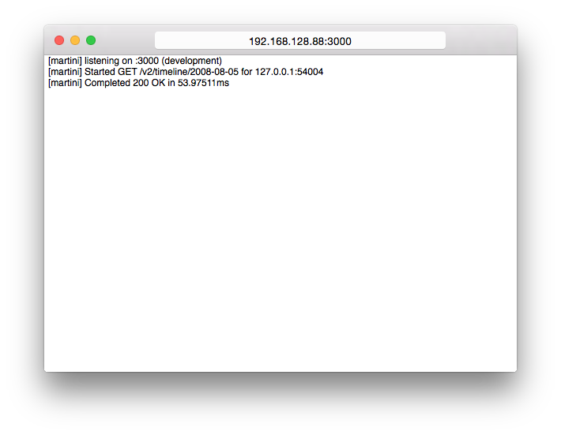
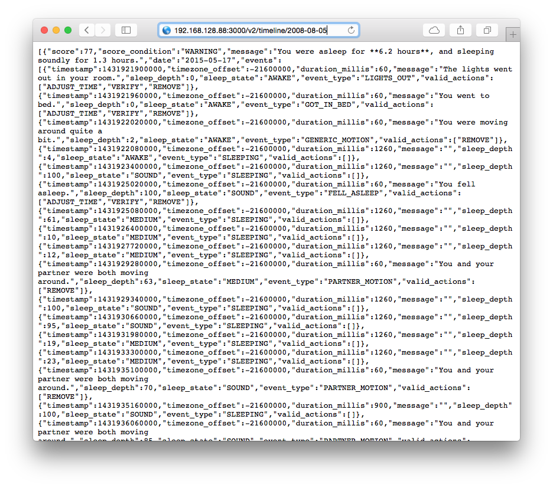

# Nonsense, App Edition™

Simple desktop app for hosting Sense API timeline data. Wraps the [nonsense](https://github.com/hello/nonsense) command-line web server.

# Installation

An installer is available from the [downloads page](https://github.com/hello/Nonsense.app/releases), otherwise build from source in Xcode.

# Usage

1. Launch Nonsense.app

2. Copy the server address from the address bar to wherever you need it!

