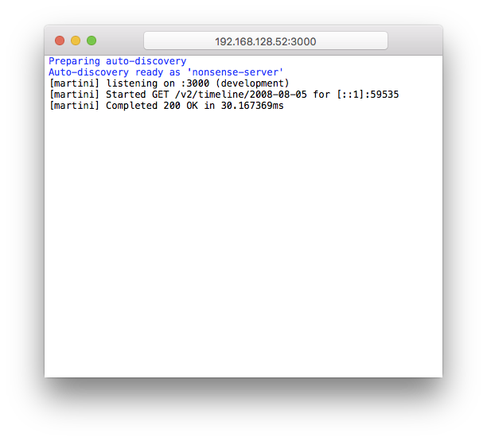
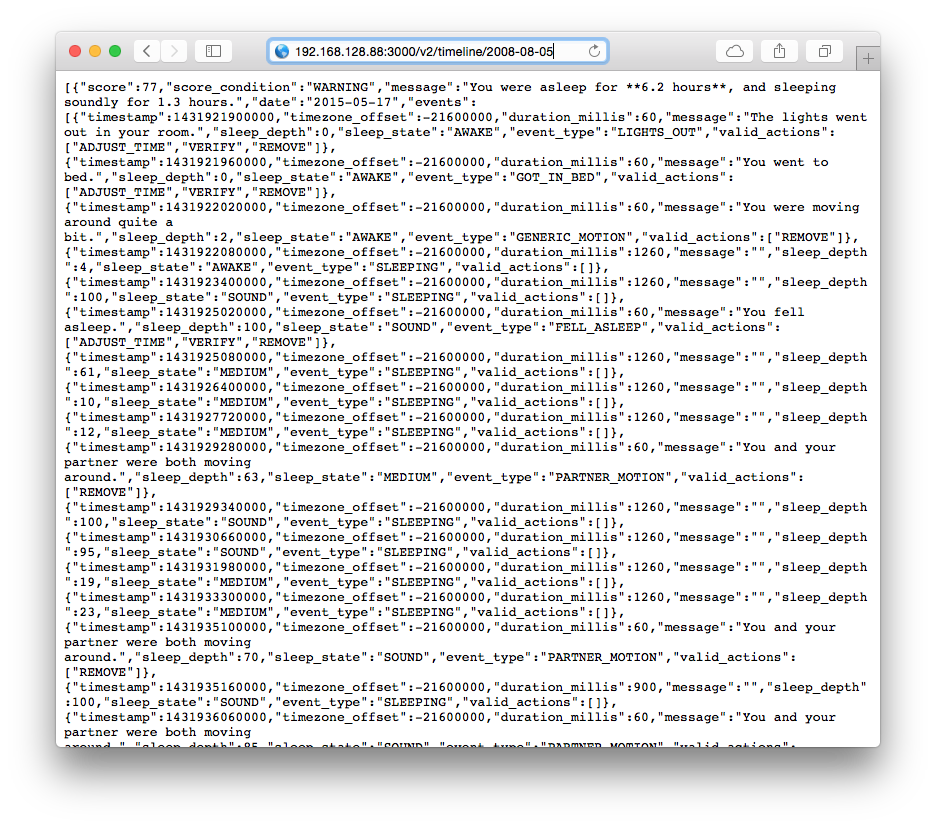
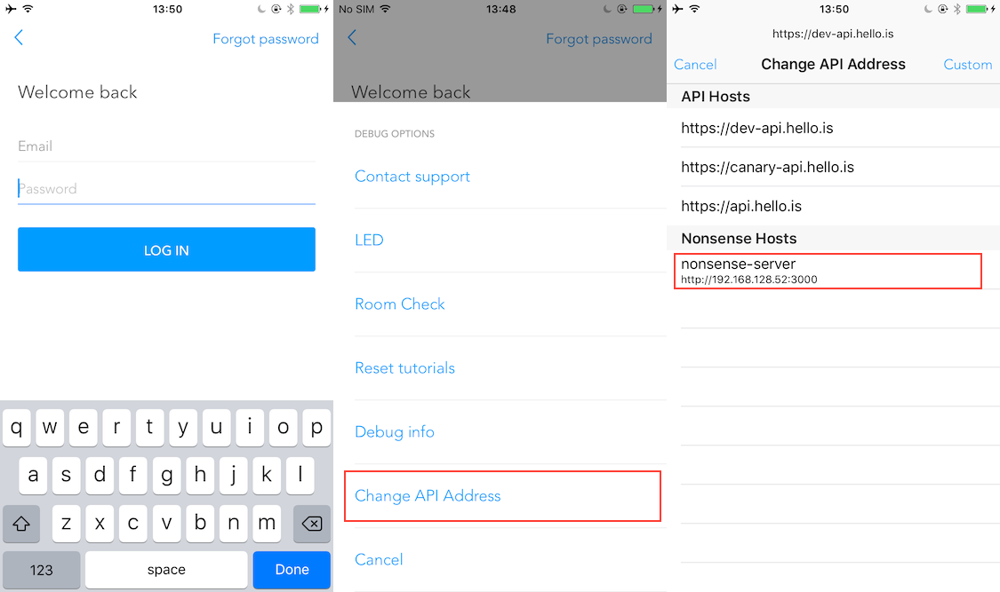
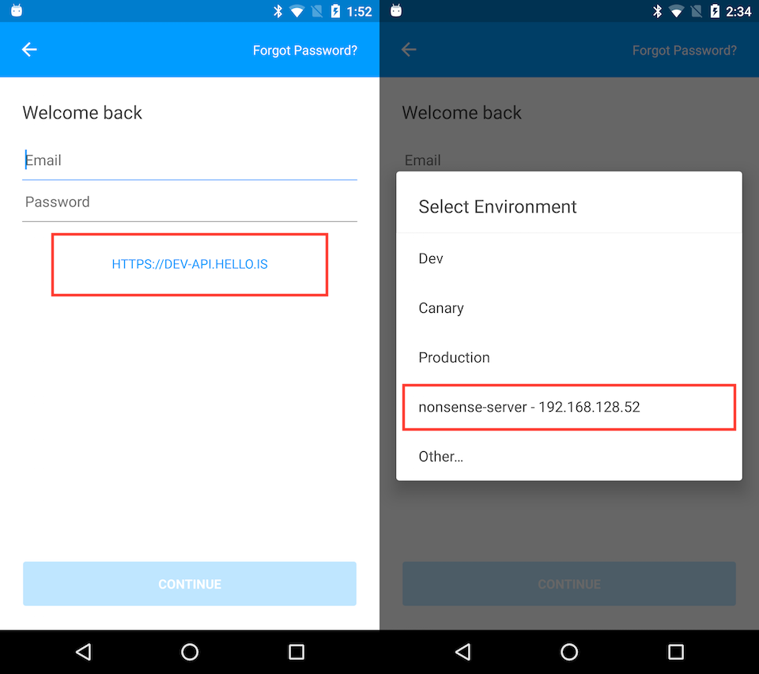

# Nonsense, App Edition™

Simple desktop app for hosting Sense API timeline data. Wraps the [nonsense](https://github.com/hello/nonsense) command-line web server,
and broadcasts the presence of the server over Bonjour on the local network.

# Installation

An installer is available from the [downloads page](https://github.com/hello/Nonsense.app/releases), otherwise build from source in Xcode.

# Usage

## Basic

1. Launch Nonsense.app

2. Copy the server address from the address bar to wherever you need it!

## iOS

1. Launch Nonsense.app

2. Open Sense.app on your phone

3. Navigate to sign in

4. Rage shake phone

5. Select "Change API Address"

6. Select the "nonsense-server" host that matches your IP address

7. Enter any credentials you'd like

## Android

1. Launch Nonsense.app

2. Open Sense app on your phone

3. Navigate to sign in

4. Tap on the blue address below the password field

5. Select the "nonsense-server" host that matches your IP address

6. Enter any credentials you'd like

